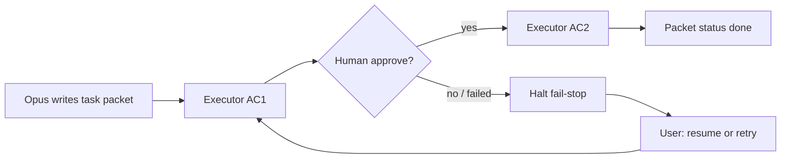

# Supervised agentic loop (harness v2)

Replaces autonomous devshop v1 kanban pipeline.

## Loop steps

1. **Plan** — Opus/Cursor loads planner-packet skill, writes `.harness/task-packet.md`
2. **Execute one AC** — small model loads execute-spec; sets AC `in-progress`; implements; runs test path; runs `check_command`
3. **Stop** — on green: mark AC `done`, report summary, **halt** (wait for human)
4. **Human gate** — user replies approve / fix hint / abort
5. **Next AC** — fresh session or `resume` for next pending AC
6. **On failure** — mark `failed`, halt; user chooses `retry` or edits packet

## Supervision levels

| Level | Gate | Eligibility |
|-------|------|-------------|
| **L0** (default) | Human gate after every AC — behavior above | Always |
| **L1** (packet mode) | Proceed AC→AC without waiting; still fail-stop on any red; halt at packet end for one human review of whole diff + red/green evidence table | ≥90% first-attempt AC pass rate over last 20 benchmarked ACs for this packet type/repo (davebench / runs baselines in spark_ops) AND packet declares `supervision: packet` in frontmatter |
| **L2** (PR mode) | Halt only at PR creation | Future — not enabled |

Non-negotiables at every level:

- Fail-stop never relaxed — no auto-retry, no watchdog re-queue ([devshop v1 learnings](devshop-v1-learnings.md))
- Budget caps unchanged
- Graduation changes approval FREQUENCY only
- **Demotion:** any packet with 2+ failed ACs drops that repo back to L0

## Commands (user → agent)

| Command | Meaning |
|---------|---------|
| `execute-spec` | Start or continue packet execution |
| `resume` | Continue from packet state after human fix/hint |
| `retry` | Re-attempt failed AC from clean git state |
| (no command) | General chat — pipeline skills inactive |

## What v2 removed

- Kanban board, stage profiles, watchdog auto-requeue
- Global pipeline rules on all Telegram messages
- `~/spark/devshop-check.sh` — replaced by packet `check_command`

## Related

- [Devshop v1 learnings](devshop-v1-learnings.md)
- [Spec handoff](spec-handoff.md)
